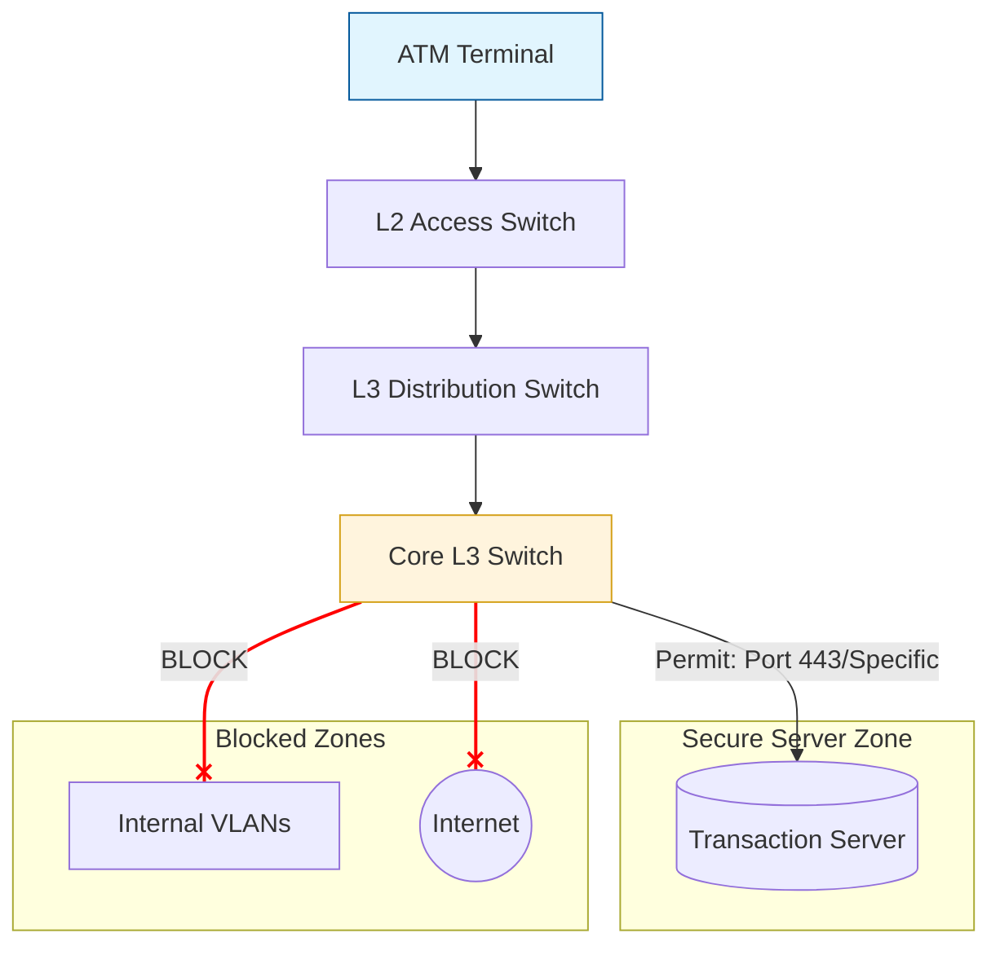
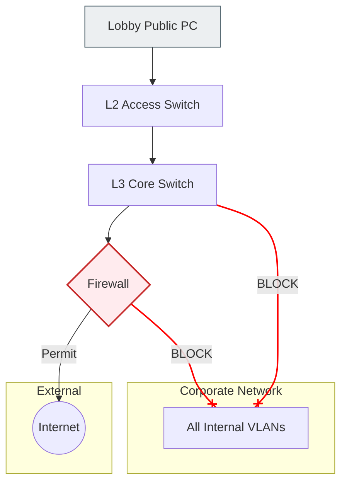
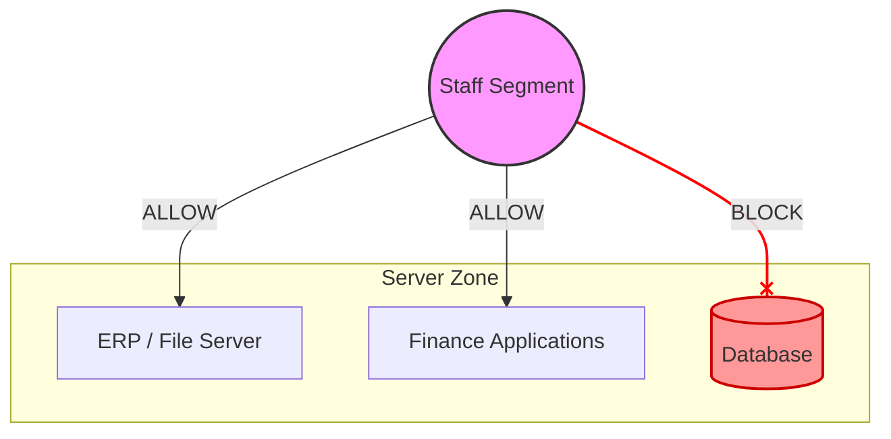
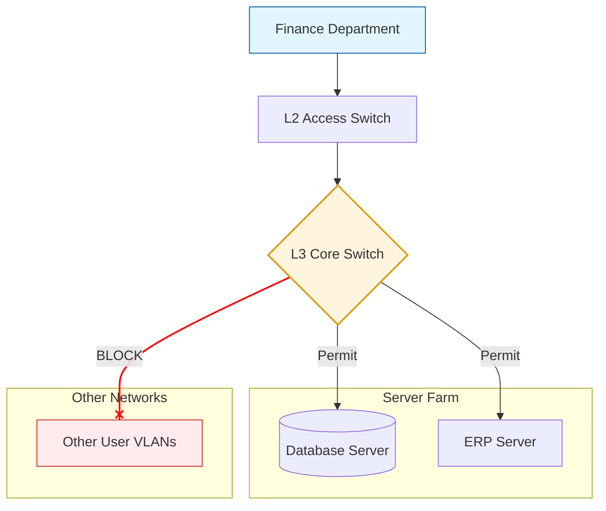
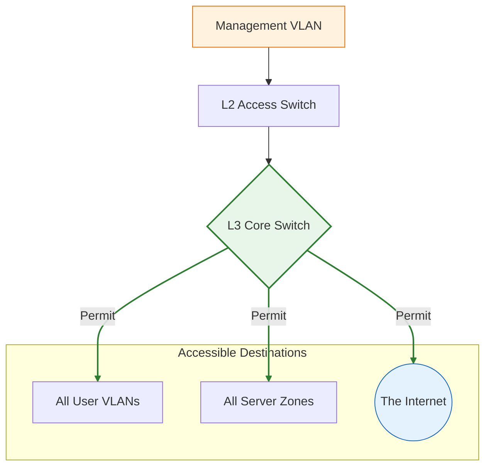
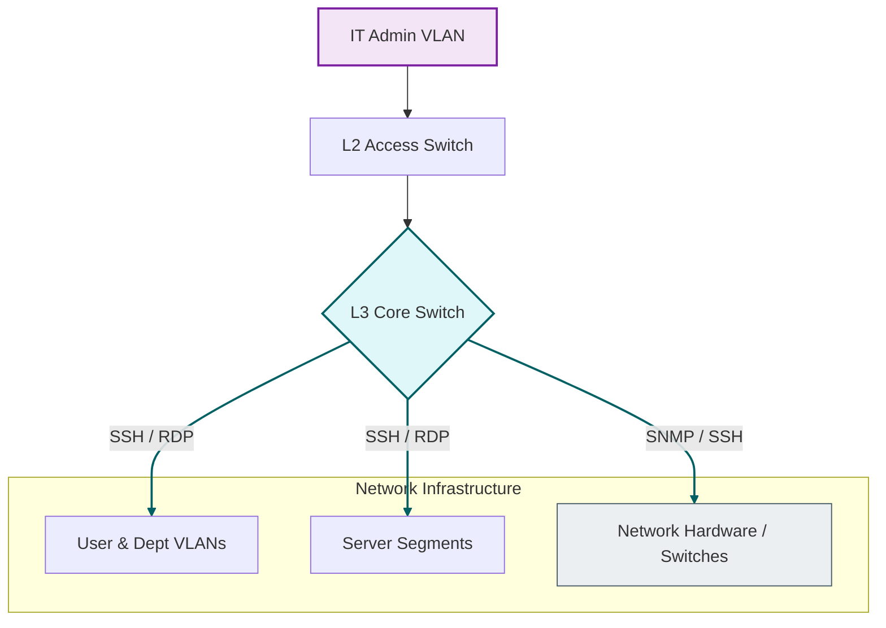
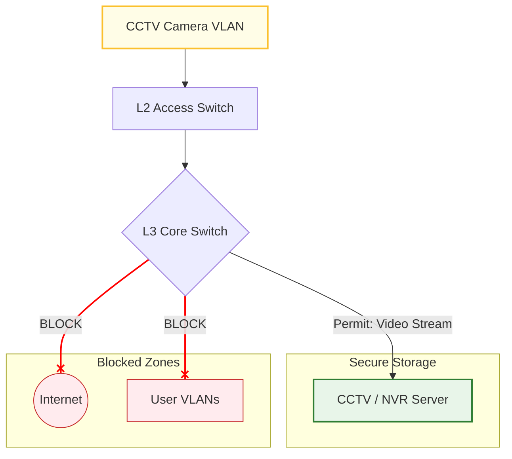
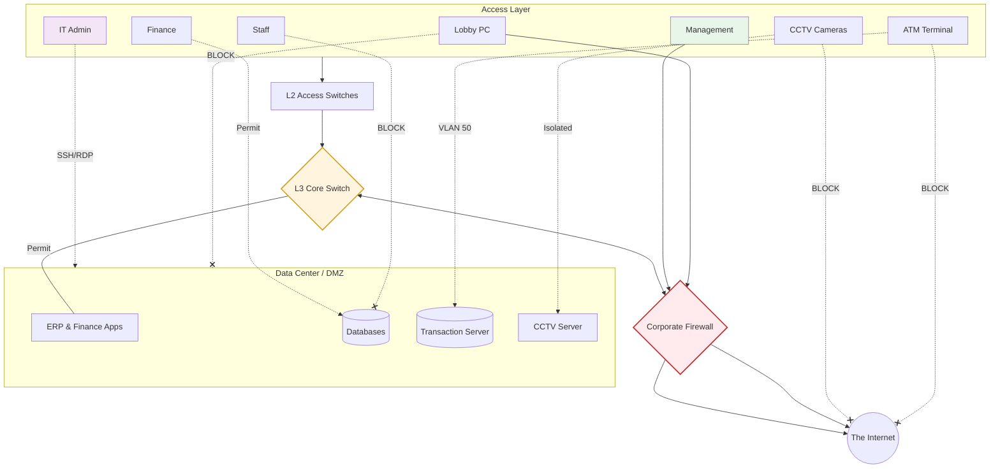

### ATM

```mermaid
graph TD
    %% Nodes
    ATM[ATM Terminal]
    L2[L2 Access Switch]
    L3[L3 Distribution Switch]
    Core[Core L3 Switch]
    
    subgraph Data_Center [Secure Server Zone]
        TS[(Transaction Server)]
    end

    subgraph Restricted [Blocked Zones]
        Internal[Internal VLANs]
        Web((Internet))
    end

    %% Physical Path
    ATM --> L2
    L2 --> L3
    L3 --> Core
    
    %% Logical ACL Rules at Core
    Core -->|Permit: Port 443/Specific| TS
    Core --x|BLOCK| Internal
    Core --x|BLOCK| Web

    %% Styling
    style ATM fill:#e1f5fe,stroke:#01579b
    style Core fill:#fff4dd,stroke:#d4a017
    linkStyle 4,5 stroke:#ff0000,stroke-width:2px;
```
### Lobby

```mermaid
graph TD
    %% Nodes
    Lobby[Lobby Public PC]
    L2[L2 Access Switch]
    L3[L3 Core Switch]
    FW{Firewall}
    
    subgraph Global [External]
        Web((Internet))
    end

    subgraph Private [Corporate Network]
        Internal[All Internal VLANs]
    end

    %% Flow
    Lobby --> L2
    L2 --> L3
    L3 --> FW
    
    %% Firewall/ACL Rules
    FW -->|Permit| Web
    FW --x|BLOCK| Internal
    L3 --x|BLOCK| Internal

    %% Styling
    style Lobby fill:#eceff1,stroke:#455a64
    style FW fill:#ffebee,stroke:#c62828,stroke-width:2px
    linkStyle 4,5 stroke:#ff0000,stroke-width:2px;
```
### Staff

```mermaid
graph TD
    %% Nodes
    Staff((Staff Segment))
    
    subgraph Resources [Server Zone]
        ERP[ERP / File Server]
        Finance[Finance Applications]
        DB[(Database)]
    end

    %% Rules
    Staff -->|ALLOW| ERP
    Staff -->|ALLOW| Finance
    Staff --x|BLOCK| DB

    %% Styling
    style Staff fill:#f9f,stroke:#333,stroke-width:2px
    style DB fill:#ff9999,stroke:#cc0000,stroke-width:2px
    linkStyle 2 stroke:#ff0000,stroke-width:2px;
```
### Finance

```mermaid
graph TD
    %% Nodes
    Fin[Finance Department]
    L2[L2 Access Switch]
    L3{L3 Core Switch}
    
    subgraph Servers [Server Farm]
        DB[(Database Server)]
        ERP[ERP Server]
    end

    subgraph Restricted [Other Networks]
        VLANs[Other User VLANs]
    end

    %% Flow
    Fin --> L2
    L2 --> L3
    
    %% Rules at L3
    L3 -->|Permit| DB
    L3 -->|Permit| ERP
    L3 --x|BLOCK| VLANs

    %% Styling
    style L3 fill:#fff4dd,stroke:#d4a017,stroke-width:2px
    style Fin fill:#e1f5fe,stroke:#01579b
    style VLANs fill:#ffebee,stroke:#c62828
    linkStyle 4 stroke:#ff0000,stroke-width:2px;
```
### Management

```mermaid
graph TD
    %% Nodes
    MGMT[Management VLAN]
    L2[L2 Access Switch]
    L3{L3 Core Switch}
    
    subgraph Dest [Accessible Destinations]
        VLANs[All User VLANs]
        Servers[All Server Zones]
        Web((The Internet))
    end

    %% Flow
    MGMT --> L2
    L2 --> L3
    
    %% Rules at L3
    L3 -->|Permit| VLANs
    L3 -->|Permit| Servers
    L3 -->|Permit| Web

    %% Styling
    style L3 fill:#e8f5e9,stroke:#2e7d32,stroke-width:2px
    style MGMT fill:#fff3e0,stroke:#ef6c00
    style Web fill:#e3f2fd,stroke:#1565c0
    linkStyle 2,3,4 stroke:#2e7d32,stroke-width:2px;
```
### IT Admin

```mermaid
graph TD
    %% Nodes
    IT[IT Admin VLAN]
    L2[L2 Access Switch]
    L3{L3 Core Switch}
    
    subgraph Infrastructure [Network Infrastructure]
        VLANs[User & Dept VLANs]
        SVR[Server Segments]
        HW[Network Hardware / Switches]
    end

    %% Physical Path
    IT --> L2
    L2 --> L3
    
    %% Logical ACL Rules
    L3 -->|SSH / RDP| VLANs
    L3 -->|SSH / RDP| SVR
    L3 -->|SNMP / SSH| HW

    %% Styling
    style IT fill:#f3e5f5,stroke:#7b1fa2,stroke-width:2px
    style L3 fill:#e0f7fa,stroke:#006064,stroke-width:2px
    style HW fill:#eceff1,stroke:#455a64
    linkStyle 2,3,4 stroke:#006064,stroke-width:2px;
```
### Security (CCTV)

```mermaid
graph TD
    %% Nodes
    CCTV[CCTV Camera VLAN]
    L2[L2 Access Switch]
    L3{L3 Core Switch}
    
    subgraph Storage [Secure Storage]
        NVR[CCTV / NVR Server]
    end

    subgraph Restricted [Blocked Zones]
        Web((Internet))
        Users[User VLANs]
    end

    %% Flow
    CCTV --> L2
    L2 --> L3
    
    %% Rules at L3
    L3 -->|Permit: Video Stream| NVR
    L3 --x|BLOCK| Web
    L3 --x|BLOCK| Users

    %% Styling
    style CCTV fill:#fffde7,stroke:#fbc02d,stroke-width:2px
    style NVR fill:#e8f5e9,stroke:#2e7d32,stroke-width:2px
    style Web fill:#ffebee,stroke:#c62828
    style Users fill:#ffebee,stroke:#c62828
    linkStyle 3,4 stroke:#ff0000,stroke-width:2px;
```
### Summary

```mermaid
graph TD
    %% User & Device Layers
    subgraph Users [Access Layer]
        Staff[Staff]
        Fin[Finance]
        MGMT[Management]
        IT[IT Admin]
        CCTV[CCTV Cameras]
        ATM[ATM Terminal]
        Lobby[Lobby PC]
    end

    %% Switching & Routing Layer
    L2[L2 Access Switches]
    L3{L3 Core Switch}
    FW{Corporate Firewall}

    %% Server Zones
    subgraph Servers [Data Center / DMZ]
        App[ERP & Finance Apps]
        DB[(Databases)]
        TSVR[(Transaction Server)]
        NVR[CCTV Server]
    end

    Web((The Internet))

    %% Physical Connections
    Users --> L2
    L2 --> L3
    L3 <--> FW

    %% Logical Rules (ACLs)
    L3 ---|Permit| App
    Fin -.->|Permit| DB
    Staff -.-x|BLOCK| DB
    IT -.->|SSH/RDP| Servers
    ATM -.->|VLAN 50| TSVR
    CCTV -.->|Isolated| NVR
    
    %% Internet Access
    MGMT --> FW --> Web
    Lobby --> FW --> Web
    
    %% Global Blocks
    Lobby -.-x|BLOCK| Servers
    CCTV -.-x|BLOCK| Web
    ATM -.-x|BLOCK| Web

    %% Styling
    style L3 fill:#fff4dd,stroke:#d4a017,stroke-width:2px
    style FW fill:#ffebee,stroke:#c62828,stroke-width:2px
    style MGMT fill:#e8f5e9
    style IT fill:#f3e5f5
```

