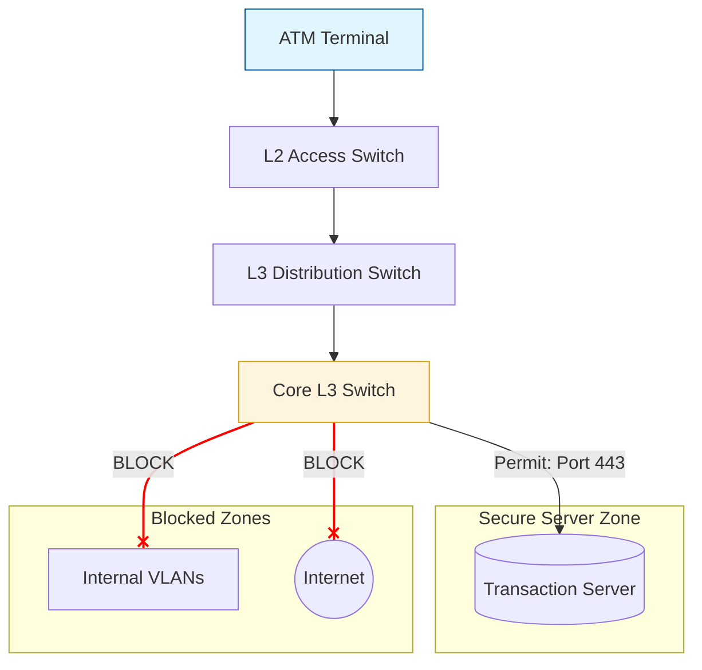
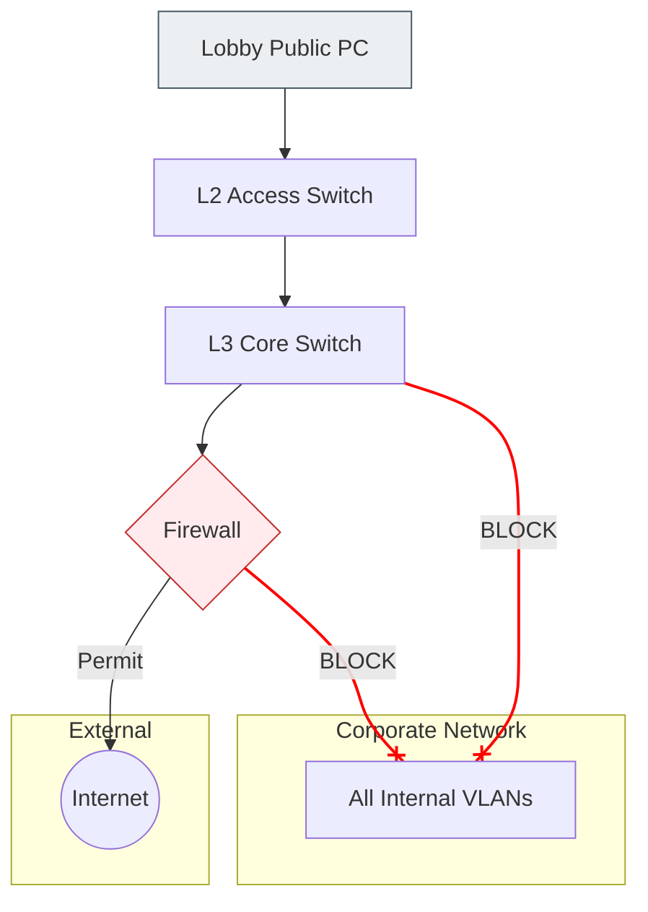

### 1. ATM Segment

```mermaid
graph TD
    ATM[ATM Terminal] --> L2[L2 Access Switch]
    L2 --> L3[L3 Distribution Switch]
    L3 --> Core[Core L3 Switch]
    
    subgraph Data_Center [Secure Server Zone]
        TS[(Transaction Server)]
    end

    subgraph Restricted [Blocked Zones]
        Internal[Internal VLANs]
        Web((Internet))
    end

    Core -->|Permit: Port 443| TS
    Core --x|BLOCK| Internal
    Core --x|BLOCK| Web

    style ATM fill:#e1f5fe,stroke:#01579b
    style Core fill:#fff4dd,stroke:#d4a017
    linkStyle 4,5 stroke:#ff0000,stroke-width:2px;
```

### 2. Lobby PC

```mermaid
graph TD
    Lobby[Lobby Public PC] --> L2[L2 Access Switch]
    L2 --> L3[L3 Core Switch]
    L3 --> FW{Firewall}
    
    subgraph Global [External]
        Web((Internet))
    end

    subgraph Private [Corporate Network]
        Internal[All Internal VLANs]
    end

    FW -->|Permit| Web
    FW --x|BLOCK| Internal
    L3 --x|BLOCK| Internal

    style Lobby fill:#eceff1,stroke:#455a64
    style FW fill:#ffebee,stroke:#c62828
    linkStyle 4,5 stroke:#ff0000,stroke-width:2px;
```
